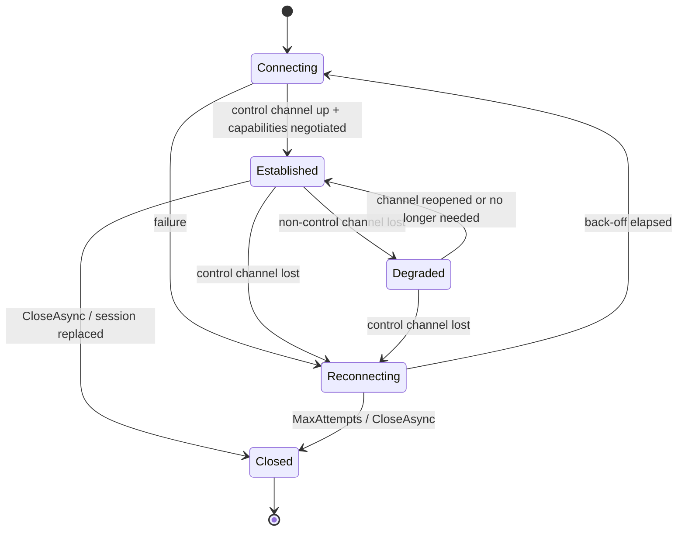
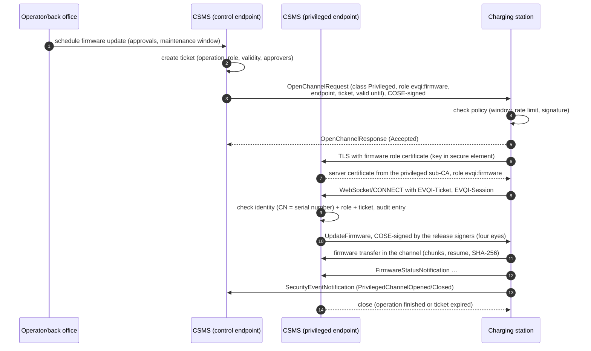

# EVQI Transport: Multi-Channel Communication between Charging Stations and CSMS

**Version 0.1, Draft**, 2026-10-03
[CC-BY-SA 4.0](https://creativecommons.org/licenses/by-sa/4.0/) · [OpenChargingTechnology/Whitepapers](https://github.com/OpenChargingTechnology/Whitepapers) · reference implementations: [Vanaheimr/Hermod](https://github.com/Vanaheimr/Hermod) (transport), [OpenChargingCloud/WWCP_OCPP](https://github.com/OpenChargingCloud/WWCP_OCPP) (OCPP)

This document describes the transport layer of
[EVQI – "Unified data exchange for electrical Vehicle charging"](https://nlnet.nl/project/EVQI/),
funded by the NLnet NGI0 Commons Fund. EVQI aims at an open, real-time communication and
validation layer with cryptographic integrity anchors, metrological correctness and low-latency
communication. It is a concept and a work plan, not yet a specification.

It elaborates the outline in
[Resilient, high-available and pooled parallel Connections](../AdvancedConnections/README.md) and
builds on [TLS Client/Server Configuration for OCPP v2.x](../TLSConfiguration/README.md),
[Metrological CBOR](../MetrologicalCBOR/README.md) and
[OCPP 2.x Firmware Updates with Software Separation](../FirmwareUpdateSeparation/README.md).

---

## Contents

0. [Summary](#0-summary)
1. [Starting point](#1-starting-point)
2. [Transport options: HTTP/1.x, HTTP/2, HTTP/3](#2-transport-options-http1x-http2-http3)
3. [WebTransport](#3-webtransport)
4. [Concept: channel sessions (`IChannelSession` / `IChannel`)](#4-concept-channel-sessions-ichannelsession--ichannel)
5. [Connection setup and discovery via DNS (HTTPS RR, SRV)](#5-connection-setup-and-discovery-via-dns-https-rr-srv)
6. [Security: role certificates, multiple client certificates, privileged channels](#6-security-role-certificates-multiple-client-certificates-privileged-channels)
7. [Message representation and message signatures: Metrological CBOR and COSE](#7-message-representation-and-message-signatures-metrological-cbor-and-cose)
8. [Reconnect policies](#8-reconnect-policies)
9. [Resource and denial-of-service protection](#9-resource-and-denial-of-service-protection)
10. [Mapping to OCPP 1.6 and OCPP 2.x](#10-mapping-to-ocpp-16-and-ocpp-2x)
11. [Implementation status](#11-implementation-status)
12. [Work plan](#12-work-plan)
13. [Open questions and decisions](#13-open-questions-and-decisions)
14. [References](#14-references)

---

## 0. Summary

**The problem.** OCPP-J knows exactly one WebSocket connection per charging station, and on it each
side may have only one CALL outstanding at a time. Everything shares this connection: small
real-time data, transactions, configuration, certificates and firmware commands. Large transfers
(logs, firmware) therefore run over separate HTTP or FTP URLs today, with credentials in the URL
and without uniform authorization or logging, or they clog the only channel. The OCPP 2.1
specification admits as much: frequent large SEND messages "may cause a delay for other messages"
(Part 4, §4.2.4).

**The proposal.** A *channel session* (`IChannelSession`) bundles several named *channels*
(`IChannel`) between one charging station and one CSMS. Every channel is a complete OCPP-J
WebSocket (RFC 6455 framing) with its own priority and its own CALL slot. It runs over one of
three bindings:

| Binding | A channel is | Transport connections per station |
|---|---|---|
| **HTTP/1.x** | its own TCP+TLS connection (RFC 6455) | one per channel |
| **HTTP/2** | its own stream via Extended CONNECT (RFC 8441) | one per role/certificate domain |
| **HTTP/3** | its own QUIC stream via Extended CONNECT (RFC 9220) | one per role/certificate domain |

**WebTransport** is treated as a separate research track (chapter 3): structurally the best fit,
but still a draft and not OCPP-J compatible.

**The load-bearing decisions:**

1. **The control channel is today's OCPP-J WebSocket, unchanged.** Everything else is used only
   after a capability negotiation, which keeps the system fully backward compatible.
2. **The synchronicity rule is per connection** (Part 4, §4.1.1: "this rule is per OCPP-J
   connection"). Every channel therefore has its own outstanding CALL. Message IDs already have
   to be unique across all connections of the same charging station identity (§4.1.4): the
   specification already allows for several connections per identity.
3. **Privileges are bound to the TLS connection.** HTTP/2 (RFC 8740) and QUIC (RFC 9001, §4.4)
   forbid client authentication after the handshake. A channel with elevated privileges therefore
   always needs its own TLS connection with its own role certificate. That is intended: firmware
   updates run over an explicit, time-limited *on-demand channel*, not over the everyday
   WebSocket, and they are logged separately and tamper-evidently.
4. **Messages are signed by default.** Future OCPP messages use
   [Metrological CBOR](../MetrologicalCBOR/README.md) as their default representation and carry
   COSE signatures (RFC 9052). Justified exceptions are allowed. The role in the connection's
   certificate is therefore only an **upper bound**: a message is executed only if both the
   connection's role and the role of the message's signer permit it (chapter 7).
5. **Reconnects and resources are governed per session.** The control channel follows the OCPP
   back-off rule exactly (§5.4). Other channels reconnect afterwards and only when needed,
   privileged ones never automatically. The server holds budgets per identity and per node and
   sheds bulk channels first under load.
6. **Discovery via DNS:** HTTPS RR (RFC 9460) first, then SRV (RFC 2782), then A/AAAA. The TLS
   certificate is always checked against the *configured* name, never against the DNS target.

**The initial questions, answered briefly:**

- *Is an HTTP/2 WebSocket limited to one stream?* One WebSocket is one stream; RFC 8441 defines it
  that way. Several WebSockets over *one* HTTP/2 connection were always possible. What is
  missing is the session layer above them.
- *Does HTTP/2 schedule by priority itself?* No. RFC 9218 only carries a priority signal; every
  sender schedules on its own. Hermod does so in both directions by now: the server sends by
  priority, and so does the client since Vanaheimr/Hermod#63. Since Vanaheimr/Hermod#62 and
  Vanaheimr/Hermod#66 a stalled reader no longer holds up the other streams of its connection.
  Loss-induced head-of-line blocking at the TCP level remains inherent to HTTP/2; only HTTP/3
  removes it.

---

## 1. Starting point

### 1.1 OCPP-J today

The following points are normative (OCPP 2.1 Edition 2, Part 4; OCPP-J 1.6):

| Topic | Rule | Source |
|---|---|---|
| Roles | charging station = WebSocket client, CSMS = server; the station keeps the connection open all the time | 2.1 Part 4 §3, §3.1 |
| Identity | identity as the last path segment of the connection URL; the CSMS is RECOMMENDED to check it against the credentials | §3.1.1 |
| Versions | negotiated via `Sec-WebSocket-Protocol` (`ocpp1.6`, `ocpp2.0.1`, `ocpp2.1`, registered with IANA) | §3.1.2 |
| Synchronicity | at most one outstanding CALL per sender, **per OCPP-J connection** (2.1: SHALL NOT, 1.6: SHOULD NOT) | §4.1.1 |
| Message IDs | unique across every WebSocket connection using the same charging station identity | §4.1.4 |
| SEND (new in 2.1) | unconfirmed, may be sent while a CALL is outstanding; warning about delaying other messages | §4.2.4 |
| Reconnect | 2.0.1/2.1: increasing back-off with a random part (`RetryBackOffWaitMinimum`, `RetryBackOffRandomRange`, `RetryBackOffRepeatTimes`); 1.6: no back-off rule | 2.1 §5.4, §8; 1.6J §5.4 |
| Local Controller | one WebSocket connection to the CSMS **per connected station** | 2.1 §6.2 |
| Signed messages (2.1) | JWS-wrapped messages with action `<Action>-Signed` | 2.1 §7 |
| File transfer | firmware download and log upload via URLs (`FileTransferProtocols`: FTP, FTPS, HTTP, HTTPS, SFTP); log upload by HTTP PUT, Basic Auth credentials inside the URL; no standardized resume (2.1, N01.FR.27) | 2.1 Part 2, L01/N01 |
| Security profiles | 1 (Basic without TLS), 2 (TLS + Basic), 3 (mTLS); one profile per port is allowed | 2.1 Part 2 A; 1.6 Security WP §2 |
| Certificates | station: CN = serial number; CSMS: CN = FQDN; Extended Key Usage should **not** be used (ISO 15118) | 2.1 Part 2, A00.FR.5xx |
| Firmware authenticity | firmware signature via a separate manufacturer PKI (Firmware Signing Certificate) | 2.1 Part 2 A, L01 |

### 1.2 What hurts

1. **Head-of-line blocking on two levels.** Everything shares one ordered byte stream, and each
   side has a single CALL slot. A large report (`NotifyReport`, `NotifyMonitoringReport`) or a
   stream of SEND messages delays time-critical control.
2. **Large files travel outside OCPP.** Firmware and logs use separate HTTP/FTP servers.
   Credentials sit in URLs, authorization and logging are not uniform, there is no resume and no
   priority control, and every firewall rule is extra infrastructure.
3. **No least privilege.** Whoever controls the one everyday connection (or holds the one client
   certificate) can do everything: load management, network profiles, certificates, firmware.
4. **Privileged operations are not logged separately.** Calibration law demands traceability for
   updates of legally relevant software (section 6.7).
5. **The number of connections scales badly.** A Local Controller with 20 stations holds 21
   connections to the CSMS. After a CSMS restart all stations reconnect at the same time.
6. **Message-level authenticity is optional.** Signed messages exist in OCPP 2.1 but are not
   required, so a TLS-terminating intermediary (Local Controller, load balancer) can read and
   alter everything it relays.

### 1.3 Requirements

| ID | Requirement |
|---|---|
| R1 | Several parallel channels per station with different priorities (real-time, control, bulk) |
| R2 | Bindings: several HTTP/1.x connections, WebSockets over HTTP/2 and over HTTP/3 |
| R3 | Evaluate WebTransport as a separate option |
| R4 | One API across all bindings (`IChannelSession` / `IChannel`) |
| R5 | Mapping to OCPP 1.6 and 2.x, backward compatible |
| R6 | Automatic reconnect policies |
| R7 | Bounded number of TCP connections; a node must not be taken down by a connection flood |
| R8 | Connection setup via DNS SRV and HTTPS RR |
| R9 | Several TLS client certificates between two hosts, with a role extension (RBAC) as in Modbus/TLS |
| R10 | Privileged operations (e.g. firmware) only over explicit on-demand channels with elevated privileges and separate logging (metrological log) |
| R11 | Metrological CBOR as the future default representation, COSE signatures on all messages by default |

### 1.4 Non-goals

- No new wire protocol below WebSocket in stage 1. Every channel speaks OCPP-J (JSON or CBOR).
- No change to the semantics of existing OCPP messages; extensions are additive only.
- No server-initiated connections to the station. The station stays the client (NAT, cellular).

---

## 2. Transport options: HTTP/1.x, HTTP/2, HTTP/3

### 2.1 HTTP/1.x + RFC 6455: one connection per channel

Every channel is its own TCP+TLS connection with its own upgrade handshake.

- **Advantages:** works through every proxy, load balancer and OCPP peer. Hermod's HTTP/1.1
  WebSocket stack is the production OCPP transport (verified with the Autobahn test suite).
  Channels are loss-independent: a lost packet on the bulk channel does not disturb the control
  channel. Different client certificates per channel are trivial because every connection has its
  own handshake.
- **Disadvantages:** every channel costs a TCP and a TLS handshake, socket and TLS buffers on the
  server, and its own keepalive. Prioritization between channels exists only indirectly (TCP
  shares fairly; the application can throttle the bulk channel). The "session" is an application
  fiction: the server has to join connections via a session token (section 4.6).

### 2.2 HTTP/2 + RFC 8441: streams over one connection

Every channel is a stream opened with Extended CONNECT (`:protocol = websocket`); the RFC 6455
framing runs unchanged inside DATA frames.

- **Scheduling.** RFC 9218 (Extensible Prioritization) only signals urgency (0–7) and the
  incremental flag. The protocol enforces nothing; every sender decides locally what to send next.
  Hermod implements this in both roles: `HTTP2SendOrder.PickNext` picks the lowest urgency, then
  non-incremental before incremental, then the least recently served stream, and each pick sends
  one DATA frame of at most the window or frame size (16 KiB by default). A real-time channel with
  `u=0` therefore overtakes a running bulk transfer with `u=6, i` after at most one frame, in both
  directions (uplink since Vanaheimr/Hermod#63).
- **Flow control.** Windows per stream and per connection. Since Vanaheimr/Hermod#62 (server) and
  Vanaheimr/Hermod#66 (client), a channel whose reader stalls no longer blocks the others: the
  client returns connection window on receipt, the server additionally as soon as the peer would
  otherwise starve. The stream window is 1 MiB, the connection window 4 MiB (configurable).
- **Limits:**
  - **TCP head-of-line blocking:** one lost segment halts *all* streams of the connection until it
    has been retransmitted. On lossy cellular links this is the relevant disadvantage compared
    with HTTP/3.
  - **Shared fate:** if the TCP connection breaks, all channels are gone.
  - **One TLS identity per connection:** RFC 8740 forbids TLS 1.3 post-handshake client
    authentication in HTTP/2. Channels with different role certificates need separate
    connections (section 6.4).
  - **Connection reuse (RFC 9113 §9.1.1):** clients may reuse a connection for other origins
    covered by the certificate. For EVQI this must be ruled out across certificate domains.
  - **Infrastructure:** many reverse proxies and load balancers terminate HTTP/2 and speak
    HTTP/1.1 to the backend; RFC 8441 must then be supported end to end. Check this before every
    rollout, and keep the fallback to HTTP/1.x working at all times.

### 2.3 HTTP/3 + RFC 9220: QUIC streams

Every channel is a bidirectional QUIC stream, again via Extended CONNECT.

- **Advantages:**
  - **Loss recovery per stream:** a lost packet halts only the channel it belongs to. This is the
    "transport-loss-independent" variant.
  - **Prioritization in the QUIC sender:** Hermod packs every datagram by `QuicStream.SendUrgency`
    (lowest urgency first, then non-incremental, then round-robin) in both roles.
  - **Cellular-friendly:** connection IDs let the connection survive NAT rebinding; the server
    validates the new path.
- **Limits:**
  - **UDP/443 is filtered** in corporate and some cellular networks. A fallback (HTTP/2, then
    HTTP/1.x) is mandatory.
  - **One TLS identity per connection** (RFC 9001 §4.4: no post-handshake client
    authentication).
  - **0-RTT is unsuitable for OCPP CALLs with side effects** (replay). It stays off, as it is in
    Hermod today.
  - **Maturity:** by its own README, Hermod's HTTP/3 stack is a reference implementation, "not for
    production traffic". Field use requires hardening (chapters 11, 12).

### 2.4 Comparison

| Property | HTTP/1.x (N connections) | HTTP/2 | HTTP/3 |
|---|---|---|---|
| Transport connections per station | N (one per channel) | 1 per certificate domain | 1 per certificate domain |
| Cost of a new channel | TCP + TLS handshake | one CONNECT stream | one CONNECT stream |
| Loss independence between channels | yes | **no** (TCP HOL) | yes |
| Priority between channels | only indirectly (throttling in the sender) | RFC 9218, both directions (Hermod) | QUIC sender urgency (Hermod) |
| A failure takes down | only the channel | all channels of the connection | all channels of the connection (but survives NAT rebinding) |
| Middlebox traversal | very good | good (TLS + ALPN `h2`), check proxies | medium (UDP) |
| Different client certificates | per channel | per connection | per connection |
| Maturity in Hermod | production | implemented, client scheduling new | reference implementation |

**Recommendation:** all three bindings behind the same API. HTTP/1.x is the always-available
fallback and the first production target. HTTP/2 becomes the default binding once the gaps of
chapter 11 are closed. HTTP/3 is preferred where UDP gets through and the stack has been hardened.

---

## 3. WebTransport

### 3.1 What WebTransport is

WebTransport over HTTP/3 (draft-ietf-webtrans-http3; Hermod implements -13) opens a *session* via
Extended CONNECT (`:protocol = webtransport`). Inside the session there are:

- unidirectional and bidirectional streams that **either side** can open,
- unreliable datagrams (RFC 9297 / RFC 9221),
- session-level flow control via capsules,
- a session-bound keying material exporter (draft §4.7).

For environments that block UDP there is the draft WebTransport over HTTP/2
(draft-ietf-webtrans-http2). Hermod does not implement it.

### 3.2 What it would mean between charging station and CSMS

- **One stream per operation instead of one channel per class.** A firmware image is a
  unidirectional stream, and so is a log upload. FIN marks the end; `RESET_STREAM` and
  `STOP_SENDING` abort a single transfer. Transfers do not block each other.
- **Server-initiated streams.** Within an existing session the CSMS can open a stream towards the
  station, e.g. to deliver a file, without first asking the station to connect. The NAT problem is
  solved inside the session. Hermod's `Http3ServerConnection` already supports this
  (`IWebTransportHost`).
- **Datagrams for ephemeral telemetry**, such as live power values for display or local load
  management, where a lost value is replaced by the next one. Datagrams are **not** suitable for
  data relevant to calibration law or billing.
- **The exporter** can bind application signatures and audit entries to exactly this session
  (section 6.7).

### 3.3 Limits

1. **Draft status.** The wire format is still changing. Interoperability exists mainly between
   browsers and servers; embedded implementations are rare.
2. **No RFC 6455 framing.** OCPP-J cannot be carried over unchanged. A binding of its own is
   needed, e.g. one message per bidirectional stream, or length-prefixed messages on a stream:
   a new OCPP transport profile and therefore standardization work.
3. **UDP filtering** as with HTTP/3. The fallback would be WebTransport over HTTP/2, which Hermod
   lacks, or falling back to OCPP-J channels.
4. **Privileges:** as with HTTP/3, one TLS identity per QUIC connection, shared by all sessions on
   it. Privileged operations still need a connection of their own.
5. **Gaps in Hermod:** `WebTransportStream` does not expose `SendUrgency`. The session API is
   synchronous and polling-based (matching the deterministic core) and reachable only through the
   core, not through the Task facade `Http3Client`.

### 3.4 Assessment

| | OCPP-J channels (H1/H2/H3) | WebTransport |
|---|---|---|
| OCPP compatibility | immediate (channel = OCPP-J) | new binding needed |
| Field readiness | H1 today, H2 soon | research |
| File transfers | bulk channel with chunks | ideal (one stream per transfer) |
| Server-initiated | only on request via the control channel | native |
| Unreliable telemetry | no | datagrams |

**Recommendation:** EVQI stage 1 relies on OCPP-J channels. WebTransport is a research track (work
package G): an "OCPP over WebTransport" prototype in Hermod, measurements against the channel
variant and, if successful, a proposal to the Open Charge Alliance. The `IChannel` API is cut so
that a WebTransport binding can implement it later (channel = bidirectional stream with message
framing, channels accepted on both sides).

---

## 4. Concept: channel sessions (`IChannelSession` / `IChannel`)

### 4.1 Terms

| Term | Meaning |
|---|---|
| **Station identity** | the OCPP identity (`identifierString`, at most 48 characters) |
| **Channel session** | the logical association of one station identity with one CSMS endpoint; spans one or more transport connections; has a lifecycle and a reconnect policy |
| **Channel** | named, bidirectional, message-oriented (RFC 6455 semantics); ordered and reliable within itself; its own CALL slot |
| **Channel class** | `Control`, `Realtime`, `Bulk`, `Privileged`; determines priority, lifetime, role and reconnect behaviour |
| **Binding** | HTTP/1.x, HTTP/2, HTTP/3 (later WebTransport) |
| **Certificate domain** | the pair of endpoint and client certificate (= role); exactly one transport connection for HTTP/2 and HTTP/3; channels of different domains **never** share a connection |

### 4.2 Channel classes

| Class | Examples | Lifetime | Priority (RFC 9218) | Role | Reconnect |
|---|---|---|---|---|---|
| `Control` | today's OCPP-J traffic: boot, heartbeat, status, transactions, remote control, charging profiles | permanent | `u=1` | `operational` | always, OCPP §5.4 |
| `Realtime` | `NotifyPeriodicEventStream` (SEND), live power for load management, display | permanent or on demand | `u=0` | `operational` | after the control channel |
| `Bulk` | log upload, `DataCollectorLog`, large reports, local authorization lists | on demand, idle timeout | `u=6, i` | `operational` or `diagnostics` | only with pending work, with resume |
| `Privileged` | firmware, security configuration, certificates, metrological parameters | explicit, time-limited | own connection (`u=3`) | `firmware`, `security-admin`, `metrology` | **never automatically** |

One rule matters: **messages that depend on each other's order stay on one channel.**
Transaction-related messages (`TransactionEvent`, or Start/Stop/MeterValues in 1.6) and the
related status notifications belong to the control channel; billing-relevant meter values do not
move to the real-time channel.

### 4.3 Specification (C# sketch, Hermod style)

```csharp
namespace org.GraphDefined.Vanaheimr.Hermod.Channels
{

    public enum ChannelClass      { Control, Realtime, Bulk, Privileged }
    public enum TransportBinding  { HTTP1, HTTP2, HTTP3, WebTransport }
    public enum ChannelCloseScope { Channel, Connection, Session }

    /// <summary>RFC 9218: urgency 0 (highest) to 7, default 3.</summary>
    public readonly record struct ChannelPriority(Byte Urgency, Boolean Incremental);

    public sealed record ChannelOptions(String           Name,
                                        ChannelClass     Class,
                                        ChannelPriority  Priority,
                                        String?          Role            = null,   // selects the certificate domain
                                        String?          Representation  = null,   // "cbor" or "json"
                                        TimeSpan?        IdleTimeout     = null,
                                        TimeSpan?        MaxLifetime     = null,
                                        String?          Ticket          = null);  // Privileged only

    public sealed record ChannelCloseInfo(UInt16             Code,
                                          String?            Reason,
                                          ChannelCloseScope  Scope,          // what went down with it?
                                          Boolean            ClosedByPeer,
                                          TimeSpan?          RetryAfter);    // server hint, if any

    public interface IChannelSecurity
    {
        String?            LocalRole        { get; }
        String?            PeerRole         { get; }   // from the peer's certificate
        X509Certificate2?  PeerCertificate  { get; }
        Byte[]?            ExportKeyingMaterial(String Label, Int32 Length);   // where the TLS stack offers it
    }

    public interface IChannel : IAsyncDisposable
    {
        String                  Name            { get; }
        ChannelClass            Class           { get; }
        TransportBinding        Binding         { get; }
        String                  SubProtocol     { get; }   // e.g. "ocpp2.1"
        String                  Representation  { get; }   // "cbor" or "json"
        ChannelPriority         Priority        { get; }
        IChannelSecurity        Security        { get; }

        Task                    UpdatePriorityAsync (ChannelPriority Priority, CancellationToken CancellationToken = default);

        Task                    SendTextAsync       (String Text,                CancellationToken CancellationToken = default);
        Task                    SendBinaryAsync     (ReadOnlyMemory<Byte> Data,  CancellationToken CancellationToken = default);
        Task<ChannelMessage?>   ReceiveAsync        (CancellationToken CancellationToken = default);   // null = closed

        Task                    CloseAsync          (UInt16 Code, String Reason, CancellationToken CancellationToken = default);
        Task<ChannelCloseInfo>  Completion          { get; }
    }

    public interface IChannelSession : IAsyncDisposable
    {
        String                          SessionId     { get; }
        String                          PeerIdentity  { get; }
        ChannelSessionState             State         { get; }   // Connecting, Established, Degraded, Reconnecting, Closed
        IReadOnlyCollection<IChannel>   Channels      { get; }

        Task<IChannel>                  OpenChannelAsync    (ChannelOptions Options, CancellationToken CancellationToken = default);
        IAsyncEnumerable<IChannel>      AcceptChannelsAsync (CancellationToken CancellationToken = default);   // server; client only with WebTransport

        Task                            CloseAsync          (UInt16 Code, String Reason, CancellationToken CancellationToken = default);
        Task<ChannelCloseInfo>          Completion          { get; }
    }

}
```

**Semantics:**

- **Ordering and reliability** hold per channel as in RFC 6455. There is no ordering across
  channels.
- **Backpressure:** `Send…Async` completes once the transport has accepted the data (flow-control
  window or socket buffer). Every channel has its own limit for pending data (like today's
  `MaxBackpressure`).
- **Priority is a hint.** Every binding maps it as well as it can (section 4.4).
  `UpdatePriorityAsync` can always be called; with HTTP/1.x it is implemented locally (throttling).
- **Closing:** `ChannelCloseInfo.Scope` states whether only this channel, the whole transport
  connection or the session is affected. The application must be able to tell the three cases
  apart.
- **Pull core, event adapter:** the API is pull-based (`ReceiveAsync`). WWCP_OCPP works with events
  today (`OnTextMessageReceived` etc.). A thin adapter runs a receive loop and raises today's
  events, so WWCP_OCPP stays usable unchanged.

### 4.4 Semantics per binding

| | HTTP/1.x | HTTP/2 | HTTP/3 | WebTransport (later) |
|---|---|---|---|---|
| Channel = | TCP+TLS connection + upgrade | Extended CONNECT stream | Extended CONNECT stream | bidirectional stream in a session |
| Session = | group of connections held together by a session token | connection(s) per certificate domain + token | as HTTP/2 | WT session |
| Priority | local throttling, otherwise TCP fairness | RFC 9218 in both directions + PRIORITY_UPDATE | QUIC sender urgency + PRIORITY_UPDATE | stream urgency (missing in Hermod) |
| Loss on channel A disturbs channel B | no | yes | no | no |
| Server opens a channel | only on request via the control channel | as HTTP/1.x | as HTTP/1.x | native |
| Limits per connection | – | `SETTINGS_MAX_CONCURRENT_STREAMS` | `MAX_STREAMS` | WT stream limits |

### 4.5 Discussion: where the abstraction leaks

1. **Different shared fate.** With HTTP/1.x a channel dies alone; with HTTP/2 and HTTP/3 all
   channels of a connection die together. The API makes this visible through `Scope` instead of
   hiding it. With HTTP/1.x the session is a fiction that lives as long as the control channel
   does. If that fails, the server closes the session's other channels; otherwise orphaned
   channels remain.
2. **Priority is a hint, not a guarantee.** HTTP/1.x cannot really prioritize between channels, it
   can only throttle the bulk channel. HTTP/2 can, until the next lost TCP segment. HTTP/3 does it
   best.
3. **Loss independence holds only *between* channels.** Within a channel everything stays ordered
   and reliable; two transfers on the same bulk channel still block each other. Only WebTransport,
   with one stream per transfer, solves that.
4. **Server-initiated channels do not exist** (except with WebTransport). The CSMS requests a
   channel via the control channel (`OpenChannel`, chapter 10), and the station opens it.
5. **Privileges bound to the connection.** A channel with a different role needs a different
   connection. With HTTP/2 and HTTP/3 the goal "one connection per station" therefore holds per
   certificate domain: one connection in everyday operation, briefly two during a firmware update.
6. **Existing identity logic.** Today's CSMS implementations commonly close all older connections
   when a new one with the same identity arrives ("newest wins"). An additional channel with the
   same identity would kill the control channel at such a peer. A station therefore opens extra
   channels **only** after a successful capability negotiation and only to the endpoints the CSMS
   announced, and "newest wins" in the CSMS becomes *per channel*.
7. **Binding choice and fallback** are policy, not API. The order is HTTP/3 → HTTP/2 → HTTP/1.x.
   Candidates come from the ALPN of the HTTPS RR (chapter 5), from `Alt-Svc` (RFC 7838) or from
   earlier connections. The choice is remembered per network and re-checked periodically with
   jitter, so nothing oscillates.

### 4.6 Conventions on the wire

- **URLs:** the station identity stays the last path segment (OCPP §3.1.1).
  - Control channel: unchanged, e.g. `wss://csms.example.com/ocpp/CS001`.
  - Further channels: to a channel endpoint **announced** by the CSMS, e.g.
    `wss://csms.example.com/ocpp-channels/CS001`. A path of their own keeps channels out of the
    "newest wins" logic of older peers.
  - Privileged channels: to an endpoint of their own, e.g. `wss://ops.csms.example.com/ocpp/CS001`
    (section 6.5).
- **Headers** (on the HTTP/1.1 upgrade or in the Extended CONNECT):
  - `EVQI-Session: <token>` – assigns the channel to its session. The token is an opaque,
    short-lived value signed by the CSMS and obtained during the capability negotiation. It serves
    **only for correlation, not for authentication**: every channel authenticates itself
    (certificate or Basic Auth) and must yield the same identity.
  - `EVQI-Channel: <name>; class=<class>; repr=<cbor|json>`
  - `EVQI-Ticket: <ticket>` – privileged channels only (section 6.5).
- **Subprotocol:** every channel negotiates the same OCPP version as the control channel
  (`ocpp2.1` etc.). A channel speaks OCPP-J, as JSON in text frames or as CBOR in binary frames
  (chapter 7).
- **Messages:** message IDs are unique across all channels (OCPP already requires this). Responses
  travel on the channel the request came on. Every channel has its own CALL slot.
- **Per-channel authorization:** for every message the receiver checks whether it is allowed on
  this channel and with this role (sections 6.3, 7.4, 10.5). Violations are answered with
  `CALLERROR` `SecurityError` (present in OCPP-J 1.6 and 2.x).

### 4.7 Lifecycle of a session



If a session loses its control channel, the session as a whole is `Reconnecting`. All other
channels are closed and reopened only after a new negotiation. A new session of the same identity
replaces the old one completely, with all its channels.

---

## 5. Connection setup and discovery via DNS (HTTPS RR, SRV)

### 5.1 Goals

Load balancing and failover across several CSMS nodes, protocol selection (ALPN
`h3`/`h2`/`http/1.1`), port and address hints and ECH, without changing the station's
configuration.

### 5.2 Procedure

1. **The starting point** is the configured OCPP endpoint URL. In OCPP 2.x it lives in the
   NetworkConnectionProfile slot (`ocppCsmsUrl`). Choosing between slots
   (`NetworkConfigurationPriority`) remains OCPP's job; discovery works *within* one slot.
2. **HTTPS RR (RFC 9460)** for the host of the URL. For port 443 this is the host name itself,
   otherwise port prefix naming applies, `_8443._https.csms.example.com` (§9.1). RFC 9460 §9.6
   explicitly applies to WebSocket as well. The ServiceMode records, sorted by SvcPriority, yield
   TargetName, `alpn`, `port`, `ipv4hint`/`ipv6hint` and `ech`; AliasMode points to another name.
3. **Without an HTTPS RR: SRV (RFC 2782)** under `_ocpp._tcp.<host>`, as already proposed in
   [TLS Configuration §1.39](../TLSConfiguration/README.md#139-dns-service-records): priority,
   weighted random selection, failover to the next target. The service name "ocpp" is **not**
   registered with IANA (as of 2026-10-03); it should be registered per RFC 6335 before
   production use.
4. **A/AAAA** with Happy Eyeballs (RFC 8305) across IPv6 and IPv4.
5. **TLS:** SNI and certificate validation against the **configured origin name**, not against the
   DNS target (RFC 9460 §9.4: the TLS SNI indicates the origin, not the TargetName). The CSMS
   certificate carries the FQDN in its CN (OCPP A00.FR.510). A manipulated DNS can therefore only
   redirect the station to servers that hold a valid certificate for the configured name: an
   outage is possible, redirection to a foreign server is not.
6. **DNS transport:** DoT/DoH to a trusted resolver, or DNSSEC validation where available.
7. **Robustness:** if DNS is unreachable, stale records are used ("serve stale", RFC 8767), plus a
   last-known-good endpoint list. A DNS outage must not prevent reconnecting.
8. **Interplay with reconnects:** failed targets rotate in priority order; after K failures across
   all targets the name is resolved again.

**Privileged endpoints are not discovered via DNS.** The CSMS announces their URL over the already
authenticated control channel, and the station accepts it only if the server certificate there
carries the matching role (chapter 6). Without DNSSEC, DNS is not authenticated and must not
decide the path to elevated privileges.

### 5.3 Status in Hermod

- **Available:**
  - Record types SRV, SVCB, HTTPS, TLSA, A/AAAA and TXT with parsers.
  - Transports UDP, TCP, DoT and DoH; a DNSSEC validator.
  - **SRV is already used when connecting:** `ATCPClient` with `DNSService` (`SRV_Spec`), available
    through the HTTP client and the `WebSocketClient`.
- **Gaps:**
  - An empty SRV answer fails the connection instead of falling back to A/AAAA.
  - There is no failover to the next SRV target. The existing `DNSSRVManager` with health tracking
    is not wired in.
  - HTTPS/SVCB records are not used to choose the connection; their SvcParams are raw bytes, and
    the JSON path stores presentation format instead of wire format there.
  - Happy Eyeballs, ECH and serve-stale are missing.
  - The Modbus client takes no `SRV_Spec`.

---

## 6. Security: role certificates, multiple client certificates, privileged channels

### 6.1 Model: Modbus/TCP Security

The Modbus/TCP Security specification (Modbus.org) carries a client's role as an X.509 extension in
its client certificate: OID `1.3.6.1.4.1.50316.802.1`, value a DER `UTF8String`. The server derives
from the role which function codes and registers are allowed. Hermod implements this in
`Hermod/Modbus/SunSpec`:

- `SunSpecRoles.RoleOid` and the four mandatory roles.
- `RoleExtractor.TryExtractRole` checks strictly: exactly one `UTF8String`, no trailing data, no
  NUL.
- `ModbusPKI.BuildSunSpecRoleExtension` creates the extension (non-critical).
- `ModbusTlsFrontend` reads the role once per connection; `AuthorizationPolicy` decides per
  request, and a denial is Modbus exception 0x01.
- `OnModbusRequest` and the OpenTelemetry metrics record the decisions.
- The Modbus/TLS energy meter writes denials and write accesses into a signed, hash-chained log
  book.

On the client side there is one certificate per connection, and the role is chosen by picking the
certificate file.

### 6.2 Transfer to EVQI

- **One role per certificate**, same encoding as Modbus (one `UTF8String`) but **its own OID**.
  Using the Modbus.org OID for OCPP semantics would be wrong. The OID comes from the arc of
  GraphDefined GmbH, IANA Private Enterprise Number **60483** (`1.3.6.1.4.1.60483`). Proposed
  allocation, to be recorded in the GraphDefined OID registry:

  | OID | Meaning |
  |---|---|
  | `1.3.6.1.4.1.60483.1` | EVQI |
  | `1.3.6.1.4.1.60483.1.1` | EVQI role extension (one DER `UTF8String`, as in Modbus/TCP Security) |
  | `1.3.6.1.4.1.60483.1.2` | certificate policy "EVQI Privileged Operations" |

  One role per certificate matches "one certificate domain = one connection" exactly, and
  `RoleExtractor` can be reused with a different OID.
- **The certificate role is an upper bound.** It states the most a connection may ever do. Because
  messages are signed by default, what is actually executed is further limited by the role of the
  message's signer (section 7.4).
- **No Extended Key Usage for roles.** OCPP advises against EKU (ISO 15118 compatibility,
  A00.FR.5xx); the role is an extension of its own.
- **Criticality:** the *operational* certificate (security profile 3, CN = serial number) carries
  the role **non-critical**, so it keeps working with legacy CSMS implementations. *Privileged*
  certificates carry it **critical**: a validator that does not know the extension rejects the
  certificate, so a stolen firmware certificate is accepted nowhere as an ordinary station
  certificate. The EVQI endpoints must accept exactly this OID explicitly. The behaviour of
  SslStream/Windows and of OpenSSL with unknown critical extensions has to be pinned down by
  tests.
- **A sub-CA of its own for privileged operations** under the CSO root, with the certificate policy
  `1.3.6.1.4.1.60483.1.2`. The privileged endpoint trusts *only* this sub-CA. This is defence in
  depth: even if role checking had a bug, an operational certificate would not chain there.
- **Both directions:** in OCPP the *station executes commands*. The station must therefore check
  that privileged commands arrive over a connection whose **server certificate** carries the
  matching role; conversely the CSMS checks the role in the station's **client certificate**.
  Roles appear in both certificates.
- **Key storage:** privileged keys belong in a secure element or TPM 2.0, or in an HSM on the CSMS
  side. Hermod, Styx and WWCP_Node have no TPM/PKCS#11 binding today, and WWCP_Node stores private
  keys unencrypted, protected by file permissions. That is a work package.
- **Short-lived privileged certificates (option):** issued per maintenance window via a CSR, in
  OCPP 2.x e.g. by `SignCertificateRequest` with a new `certificateType` for role certificates.
  This limits the damage of a lost key and makes revocation lists largely unnecessary.

### 6.3 Role model (proposal)

| Role | May (excerpt) | Channel class |
|---|---|---|
| `evqi:operational` | everyday operation: boot, heartbeat, status, transactions, authorization, remote start/stop, charging profiles, reservations, `TriggerMessage`, `GetVariables`, periodic event streams | Control, Realtime, Bulk |
| `evqi:diagnostics` | `GetLog` uploads, `DataCollectorLog`, large reports, monitoring reports | Bulk |
| `evqi:security-admin` | `InstallCertificate`, `DeleteCertificate`, `CertificateSigned`, `SetNetworkProfile`, `SetVariables` on `SecurityCtrlr`/`OCPPCommCtrlr`/`EVQICtrlr` (1.6: `ChangeConfiguration` of security keys), signature policies and user roles | Privileged |
| `evqi:firmware` | `UpdateFirmware` / `SignedUpdateFirmware`, `PublishFirmware` / `UnpublishFirmware`, `FirmwareStatusNotification`, firmware transfer, for firmware components without regulatory classification | Privileged |
| `evqi:metrology` | parameters and software relevant to calibration law, including metrologically classified firmware components, retrieval of the metrological log | Privileged |

The split between `evqi:firmware` and `evqi:metrology` follows the firmware component model of
[Firmware Updates with Software Separation](../FirmwareUpdateSeparation/README.md): a component's
regulatory classification decides which role may update it.

Customer-related data (`CustomerInformation`) may deserve a role of its own for data protection
reasons. The model is a proposal and is to be agreed with operators, manufacturers and PTB.

### 6.4 Certificate selection per channel

- **Client:** every channel belongs to a certificate domain through its role. With HTTP/1.x every
  connection picks its certificate (Hermod: `LocalCertificateSelector` on the `WebSocketClient`).
  With HTTP/2 and HTTP/3 there is a connection pool keyed by (endpoint, role); coalescing across
  domains is ruled out.
- **Server:** separate endpoints per domain (host name/SNI or port) are the simplest and most
  robust solution. They allow separate infrastructure, network segmentation, HSM integration and
  logging. With TLS 1.3 the server could also hint the matching CA on one endpoint via the
  `certificate_authorities` extension of the CertificateRequest; EVQI does not need this.

### 6.5 On-demand channel with elevated privileges: procedure



Rules:

1. The request on the control channel is harmless in itself: it only asks for a connection. It is
   signed nevertheless (chapter 7), so that its origin from the CSMS is verifiable even across a
   Local Controller.
2. The station executes privileged commands **only** on a privileged channel and only with a valid
   signature of an authorized signer (section 7.4). For the migration there is the station policy
   `PrivilegedActionsOnControlChannel` with the levels `Allowed` (legacy behaviour),
   `AllowedAndLogged` and `Rejected` (target, answered with `CALLERROR SecurityError`).
3. **No automatic reconnect.** Within the ticket's validity a few retries are allowed (e.g. 3);
   after that a new ticket is required.
4. The channel closes when the operation ends or the ticket expires, at the latest after
   `MaxLifetime`.
5. The firmware signature of the manufacturer PKI remains the authenticity anchor of the image.
   The privileged channel and the message signatures govern *who* may trigger an update, and they
   log it. The mechanisms complement each other.

### 6.6 Local Controller and privileged channels

A Local Controller terminates TLS (OCPP 2.1 §6.5). If the privileged channel ran through it, it
would itself need the firmware role, which is to be avoided. Two options:

- **(a)** For privileged channels the station connects directly to the `ops` endpoint. This
  requires network reachability.
- **(b)** The Local Controller tunnels the privileged channel blindly: via classic CONNECT (TCP)
  over HTTP/2 or via CONNECT-UDP (RFC 9298) over HTTP/3. The TLS connection then runs end to end
  from the station to the CSMS.

Message signatures (chapter 7) keep the commands authentic in both cases, but only option (b) or
(a) keeps the transport privileges away from the Local Controller. Decision open (chapter 13).

### 6.7 Separate logging (audit log and metrological log)

- **What:** every message on privileged channels; opening, closing and rejecting channels; role
  violations; the ticket lifecycle. On the station additionally every step of a firmware update
  (download, check, installation, restart, version change).
- **How:** append-only, hash-chained, signed per entry, with sequence numbers to detect gaps.
  Signed messages are stored **as received**, as COSE objects, so they can be verified again years
  later (deterministic encoding, chapter 7). Proposed fields: `seq`, `ts`, `prevHash`,
  `sessionId`, `channel`, `ticket`, `role`, `signerKid`, `peerCertSHA256`, `direction`,
  `messageType`, `action`, `messageId`, `payloadSHA256` or the COSE object itself, `result`. Where
  the TLS stack offers an exporter, an exporter value binds the entry to the connection (Hermod's
  own QUIC TLS stack has `ExportKeyingMaterial`; for SslStream this remains to be checked).
- **Reuse:** WWCP_Node already has a fitting format, `Logging/SignedLog.cs` (JSON Lines under
  `logs/metrological/`, hash chain, ECDSA P-256, `Verify`, `Log.Metrological(…)`), and the
  Modbus/TLS energy meter uses the same pattern. EVQI builds on it rather than inventing a third
  format.
- **Calibration law:** for updates of legally relevant software, MID and WELMEC Guide 7.2 require,
  among other things, traceability, typically through an event logger. Which events are relevant
  to calibration law, and which log format a conformity assessment accepts, is to be clarified
  with PTB (chapter 13).
- **Retrieval:** OCPP 2.1 knows the log types `DiagnosticsLog`, `SecurityLog` and
  `DataCollectorLog`. New would be `EVQIAuditLog` and `MetrologicalLog` (section 10.6, E6). The
  upload uses the bulk channel; until standardized, via `DataTransfer`/`customData`.

---

## 7. Message representation and message signatures: Metrological CBOR and COSE

### 7.1 Metrological CBOR as the default representation

Today OCPP-J messages are JSON text. EVQI makes **CBOR** (RFC 8949) in deterministic encoding
(RFC 8949, §4.2.1) the future default representation of OCPP messages, with every measured value
encoded as a [Metrological CBOR](../MetrologicalCBOR/README.md) value (CBOR tag 44252, registered
with IANA on 2026-08-19).

- **Why CBOR:**
  - **Exact values with unit, SI prefix and measurement uncertainty.** A reading stays the reading
    the instrument displayed: `1.10 kWh` remains distinguishable from `1.1 kWh`, `5.00 mA` is not
    silently turned into `0.005 A`, and the uncertainty is stated according to GUM. JSON numbers
    can express none of this reliably.
  - **Deterministic encoding.** The bytes of a message are a function of its content. That makes
    messages signable without a separate canonicalization step, and a re-encoded message still
    verifies.
  - **Compactness.** Signatures, certificates and binary data are byte strings instead of base64
    text. Once every message is signed, the signature is often the largest field; in a textual
    encoding it grows by a third again.
  - **Robust degradation.** A generic CBOR decoder that does not know tag 44252 still sees a
    well-formed array of standard numbers.
- **Framing:** the OCPP-J message array maps one-to-one onto a CBOR array
  (`[MessageTypeId, MessageId, Action, Payload]`), sent in WebSocket **binary** frames. In
  version 1 the payload is a CBOR map with the field names of the OCPP JSON schemas as text keys;
  integer keys for further compactness are an option for later (chapter 13).
- **Negotiation per channel:** the representation is part of the capability negotiation
  (`representations: ["cbor", "json"]`) and fixed for the lifetime of a channel
  (`EVQI-Channel: …; repr=cbor`). The control channel stays JSON towards legacy peers.
- **Gateways to JSON-only peers:** [metrological-text.md](../MetrologicalCBOR/metrological-text.md)
  defines the text form of a metrological value and the CBOR ↔ JSON document conversion. A
  signature covers CBOR bytes, though, so a gateway must carry a signed object **unchanged** (as a
  byte string, e.g. base64url inside JSON) instead of converting or re-signing its content.

### 7.2 COSE-signed OCPP messages

- **Structures (RFC 9052):**
  - `COSE_Sign1` for a message with one signer.
  - `COSE_Sign` for several signers on one message, e.g. a firmware update approved under the
    four-eyes principle carries two signatures.
  - **Countersignatures (RFC 9338)** for parties that endorse a message without adding content
    (Local Controller, a CSMS forwarding data to third parties).
  - The layering follows the [worked example of Metrological CBOR](../MetrologicalCBOR/tag-44252-signed-example.md):
    the meter signs its readings, the station signs its own statement around them, the operator
    countersigns.
- **What a signature covers:** besides the payload, the protected header carries the algorithm,
  the key identifier (`kid`, e.g. an RFC 9679 thumbprint, or `x5t`/`x5chain`) and the OCPP context:
  message type, message ID, action, sender and destination identity, a timestamp, and for
  responses the ID of the request. A signature can therefore not be replayed into another message,
  towards another station or later. Freshness rests on the timestamp window plus message ID
  uniqueness, which OCPP already requires per identity; it presupposes trustworthy time (see
  [Secure Time Synchronization](../SecureTimeSync/README.md)).
- **Confidentiality where needed:** `COSE_Encrypt0`/`COSE_Encrypt` with an AEAD algorithm
  (AES-GCM, ChaCha20-Poly1305), e.g. end to end through a Local Controller. Message-level
  encryption without authentication is not used.
- **JSON channels:** the JSON counterpart is the JWS format of OCPP 2.1 §7 (`<Action>-Signed`), with
  the same semantics.
- **Algorithms:** those permitted by OCPP (ES256 etc.), plus brainpool curves (ESB256) where
  metrology requires them, EdDSA, and ML-DSA as the post-quantum option.
- **Implementation:** [Styx COSE](https://github.com/Vanaheimr/Styx/tree/master/Styx/Illias/COSE)
  already provides `COSE_Sign1`, `COSE_Sign` with several signers, countersignatures,
  `COSE_Encrypt0`/`COSE_Encrypt`, `COSE_Mac0`/`COSE_Mac`, COSE keys with RFC 9679 thumbprints, the
  fully-specified algorithms of RFC 9864, the brainpool curves and ML-DSA.

### 7.3 Signed by default, justified exceptions

**All future OCPP messages are signed by default.** Exceptions are allowed when they are justified,
declared in a policy table (device model and capability negotiation) and still authorized and
logged at the connection level. Examples of justified exceptions:

- high-frequency SEND telemetry on the real-time channel, signed per batch or by periodic signed
  checkpoints (e.g. a hash chain over the last N messages) instead of per message;
- pure liveness messages such as `Heartbeat`;
- constrained devices during the migration, for a limited time.

Exceptions never cover privileged operations: messages on privileged channels are always signed.

### 7.4 Certificate roles as an upper bound

Authorization works on two levels:

1. **Connection role:** the role extension of the TLS certificate (chapter 6). It states what may
   happen on this channel at all: the **upper bound**.
2. **Signer role:** the role of whoever signed the message: a person, a system or a device. It is
   bound to the signing key, e.g. by the same role extension (`1.3.6.1.4.1.60483.1.1`) in the
   signer's certificate, or by a signed role assignment. It states who actually authorized this
   message.

**Effective permission = connection role ∩ signer role.** A message is executed only if both
permit it.

- A powerful signer cannot exceed the channel's ceiling: a firmware command signed by the release
  manager is still rejected on the control channel.
- A privileged channel does not make an unsigned or wrongly signed message admissible.
- Unsigned messages (the exceptions of section 7.3) are authorized by the connection role alone.
  Exceptions must therefore be confined to low-privilege actions.

Consequences:

- **End-to-end authority across TLS-terminating intermediaries.** A Local Controller or load
  balancer can relay a command but cannot forge it, because it lacks the signer's key.
- **A stolen connection credential is not enough** for privileged actions. The signer keys can
  live in the HSM or smart card of the operator's staff, and the four-eyes principle becomes two
  signatures in one `COSE_Sign`.
- **Non-repudiation.** The audit log keeps the original COSE objects (section 6.7), verifiable
  long after the event thanks to deterministic encoding.
- **Metrology end to end.** A meter reading signed by the meter is authenticated independently of
  every transport and every intermediary, as German calibration law's transparency requirements
  expect.

---

## 8. Reconnect policies

### 8.1 Starting point

- **OCPP 2.x §5.4:** the first attempt comes after `RetryBackOffWaitMinimum` plus a random value up
  to `RetryBackOffRandomRange`. The waiting time then doubles up to `RetryBackOffRepeatTimes`
  times, with a new random part on every attempt, and stays constant afterwards; it resets after
  success. BootNotification is sent only when something changed.
- **OCPP 1.6J** has no back-off rule.
- **Hermod:** `WebSocketClientReconnectPolicy` (by default 1 s initial, 30 s maximum, ×2, ±20 %
  jitter, unlimited attempts). `Retry-After` is honoured up to 5 min. 408, 429 and 5xx count as
  temporary; a clean close, a protocol violation or any other HTTP status is final. Close code
  1013 ("Try Again Later") is not treated specially.
- **WWCP_OCPP:** the `OCPPCommCtrlr` variables exist but are not read anywhere; Hermod's default
  policy runs instead. The random part differs: OCPP adds `[0, RandomRange]`, Hermod multiplies by
  ±20 %. OCPP conformance needs an additive mode in the policy.

### 8.2 Policy per channel class

| Class | When to reconnect | Back-off | Particulars |
|---|---|---|---|
| `Control` | always | exactly OCPP §5.4 (`OCPPCommCtrlr` variables; mirrored as configuration keys for 1.6) | binding fallback H3 → H2 → H1 after N failures |
| `Realtime` | once the control channel is up and negotiated, random delay 0–5 s | like Control, capped | skipped while no streams are configured |
| `Bulk` | only while a transfer is pending | like Control | resume from the last acknowledged offset |
| `Privileged` | never automatically | at most 3 retries within the ticket's validity | then a new ticket is required |

### 8.3 Server hints and storm avoidance

- **Server hints:**
  - `503` or `429` with `Retry-After` on the upgrade or CONNECT.
  - WebSocket close 1013 ("Try Again Later"), optionally with a waiting time in the reason text.
  - `GOAWAY` (HTTP/2, HTTP/3) for an orderly drain before a restart.

  The client waits `max(own back-off, server hint)` plus its own random part, capped.
- **Restart storms:** after a CSMS restart the random part spreads the reconnects. The server also
  admits gradually (token bucket) and randomizes its `Retry-After` values, so that rejected
  stations do not all return in the same second.
- **Liveness:** WebSocket ping (`WebSocketPingInterval`) per channel with HTTP/1.x. With HTTP/2 or
  HTTP/3 one `PING` or QUIC keepalive per connection covers all channels. Note: Hermod's HTTP/2
  server closes a connection after 120 s without inbound frames, so without keepalive a quiet
  channel dies; QUIC has a 30 s idle timeout, likewise without keepalive by default.
- **Queues:** transaction messages buffered while offline stay on the control channel, in order.
  Bulk transfers resume instead of restarting.

---

## 9. Resource and denial-of-service protection

### 9.1 Connection budget

| Scenario | today | HTTP/1.x binding | HTTP/2 or HTTP/3 binding |
|---|---|---|---|
| 10,000 stations, Control + Realtime permanent, 5 % with an active bulk transfer | 10,000 | 20,500 | 10,000 |
| plus 20 firmware updates in progress | – | +20 | +20 (own certificate domain) |
| Local Controller with 20 stations, towards the CSMS | 21 | up to 41 (with Realtime) | 1 (all station channels as streams) + 1 own channel |

Per station:

- HTTP/1.x: number of transport connections = Σ open channels.
- HTTP/2 and HTTP/3: number of transport connections = number of active certificate domains
  (typically 1, briefly 2).

The gain is largest for the Local Controller: its connections to the CSMS, one per station today
(OCPP 2.1 §6.2), become one.

### 9.2 Limits on the station

- at most 4 channels per session (Control, Realtime, Bulk, Privileged), at most 1 bulk transfer at
  a time;
- at most 1 new channel per 10 s;
- no speculative extra channels without a capability negotiation;
- privileged channels only with a valid ticket;
- with HTTP/1.x never more connections to the same CSMS than the negotiated channel count.

### 9.3 Limits on the server (CSMS node)

**Before authentication** (cheap, per source):

- accept rate per IPv4 /24 or IPv6 /64 prefix;
- a bounded number of concurrent TLS handshakes;
- handshake and header timeouts;
- a maximum header size.

Per-IP limits must be generous: behind a carrier-grade NAT many stations share one IPv4 address.
The real limits apply per identity.

**After authentication** (per identity):

| Limit | Proposal |
|---|---|
| Sessions per identity | 1 (a new session replaces the old one completely) |
| Channels per session and class | Control 1, Realtime 1, Bulk 1, Privileged 1 |
| Channel with a foreign session token | reject (403) |
| CALLs in progress | 1 per channel and direction (OCPP rule) + a cap on response queues |
| Message size | Control 64 KiB, Realtime 16 KiB, bulk chunk 1 MiB (for the assembled message, not just the frame) |
| Message rate | token bucket per channel |
| HTTP/2 `MAX_CONCURRENT_STREAMS` for station connections | 8 |
| Idle timeouts | short for Bulk and Privileged; Control and Realtime kept alive by pings |
| Signature verification | rate-limited per identity, verified before any expensive processing |

**Per node:**

- a cap on concurrent bulk transfers;
- memory budget = Σ flow-control windows of open channels, windows sized by channel class;
- **load shedding by class:** Bulk first (503 + randomized `Retry-After`), then Realtime; Control
  and Privileged stay;
- an orderly restart drains via `GOAWAY` and readmits gradually.

**Authenticate before the upgrade.** Reject before sending `101` or `200`, so the cost asymmetry
lies with the attacker.

### 9.4 Status in the code

- **Hermod HTTP/1.1 WebSocket server:**
  - Available:
    - handshake timeout 10 s, maximum handshake size 64 KiB;
    - `MaxClientConnections` 8192;
    - message size limit 64 MiB;
    - authentication before the `101`.
  - Gaps:
    - `MaxConnectionsPerIP` is off by default, and when it triggers the socket is closed without
      an HTTP answer.
    - There is no accept rate limiter.
    - 503 with `Retry-After` is only available through a custom `OnValidateWebSocketConnection`
      handler.
- **Hermod HTTP/2:**
  - `MAX_CONCURRENT_STREAMS` is fixed at 100 and not configurable on the server.
  - The server has no total or per-IP connection limit.
  - Message-size and decompression limits for WebSockets over HTTP/2 and HTTP/3 are being added
    (fix in progress).
- **Hermod HTTP/3:**
  - `maxConnections` 1024.
  - `Http3Tunnel` has no write backpressure and an unbounded receive queue.
- **WWCP / CSMS:**
  - `MaxConnections` 250.
  - No limits per identity, no message rates, no cap on outstanding requests.

---

## 10. Mapping to OCPP 1.6 and OCPP 2.x

### 10.1 Principles

| ID | Principle |
|---|---|
| P1 | The control channel is plain OCPP-J. An EVQI station works with every CSMS, an EVQI CSMS with every station. |
| P2 | Extra channels only after a successful capability negotiation, and only to announced endpoints. |
| P3 | Every channel has full OCPP-J semantics: CALL/CALLRESULT/CALLERROR (2.1 also CALLRESULTERROR and SEND), its own CALL slot, IDs unique per identity. |
| P4 | Per-channel authorization by class, connection role and signer role; a violation → `CALLERROR SecurityError`. |
| P5 | Extensions are additive: in 1.6 via `DataTransfer` and configuration keys, in 2.x via `DataTransfer`, `customData` and a device model component, later as a proposal to the OCA. |
| P6 | Messages are signed by default (COSE for CBOR, JWS for JSON); exceptions are declared. |

### 10.2 Capability negotiation: `ChannelSession`

After every (re)connect of the control channel the station asks. Under §5.4 a BootNotification is
sent only after changes, so it cannot serve this purpose.

```json
[2, "a1b2c3", "DataTransfer", {
  "vendorId":  "org.openchargingcloud.evqi",
  "messageId": "ChannelSession",
  "data": {
    "bindings":        ["h3", "h2", "http/1.1"],
    "channelClasses":  ["Realtime", "Bulk", "Privileged"],
    "roles":           ["evqi:operational", "evqi:firmware"],
    "representations": ["cbor", "json"],
    "signatures":      ["COSE", "JWS"],
    "maxChannels":     4
  }
}]
```

The response contains:

- `sessionToken` (signed, short-lived);
- the channel endpoint URL(s) and the allowed bindings;
- the agreed representation and signature policy, including the list of message types exempt from
  signing;
- limits (channels, message sizes, rates);
- the list of channels to keep open permanently, e.g. `Realtime`.

If the CSMS does not know the message, it answers `UnknownVendorId`, and the station stays with one
channel (P1).

### 10.3 OCPP 1.6 (OCPP-J 1.6 + Security Whitepaper Edition 3)

- **Control channel:** unchanged `ocpp1.6`.
- **Negotiation and requests:** via `DataTransfer` (`ChannelSession`, `OpenChannel`,
  `ChannelStatus`).
- **Configuration:** keys of their own via `GetConfiguration`/`ChangeConfiguration`, e.g.
  `EVQIEnabled`, `EVQIChannelEndpoint`, `EVQIRetryBackOff…`. The 2.x reconnect back-off is mirrored
  because 1.6 has none.
- **Bulk without new messages:** `GetDiagnostics.location` or `GetLog.log.remoteLocation` receives a
  URI with the scheme `evqi:` (e.g. `evqi:transfer/7f3c…`). The station then uploads over the bulk
  channel instead of FTP or HTTP. Legacy stations never receive such a scheme, because it is used
  only after negotiation.
- **Firmware:** `SignedUpdateFirmware` (Security Whitepaper) on the privileged channel, the image via
  an `evqi:` location inside the channel. Unsigned `UpdateFirmware` is rejected in EVQI mode.
- **Security-relevant keys** (`SecurityProfile`, `AuthorizationKey`) may only be changed over the
  privileged channel (`security-admin`). The whitepaper already forbids lowering the security
  profile via OCPP (A00.FR.005/006).
- **Signatures:** 1.6 has no signed messages of its own; in EVQI mode the JWS format of OCPP 2.1 §7
  or COSE on CBOR channels is used.
- **Synchronicity:** only SHOULD NOT in 1.6, but likewise per connection. One CALL per channel.

### 10.4 OCPP 2.0.1 and 2.1

- **Control channel:** unchanged (`ocpp2.0.1` or `ocpp2.1`).
- **Device model:** a new component `EVQICtrlr` with the variables `Enabled`, `SupportedBindings`,
  `SupportedChannelClasses`, `MaxChannels`, `AvailableRoles`, `Representations`,
  `SignaturePolicy`, `PrivilegedActionsOnControlChannel`, `AuditLogEnabled`, `DiscoveryMode`
  (HTTPS RR/SRV/off). The CSMS reads them via `GetVariables`/`NotifyReport`.
- **Reconnect:** `OCPPCommCtrlr` as specified for the control channel; variables for Bulk and
  Realtime in `EVQICtrlr`.
- **Real-time:** the periodic event streams of 2.1 keep their control messages
  (`Open…`/`Close…`/`AdjustPeriodicEventStream`) on the control channel; the data
  (`NotifyPeriodicEventStream`, SEND) moves to the real-time channel. That removes exactly the delay
  §4.2.4 warns about.
- **Bulk:**
  - `GetLog` with an `evqi:` `remoteLocation`. It replaces the HTTP PUT with credentials in the URL
    and brings the resume that OCPP 2.1 itself notes as missing (N01.FR.27).
  - Large `NotifyReport`/`NotifyMonitoringReport` sequences and `SendLocalList` travel on the bulk
    channel.
- **Firmware:** `UpdateFirmware`, `PublishFirmware` and `FirmwareStatusNotification` on the
  privileged channel (`evqi:firmware` or `evqi:metrology`, by component classification), plus a
  summary as `SecurityEventNotification` on the control channel.
- **Security:** `InstallCertificate`, `DeleteCertificate`, `CertificateSigned`, `SetNetworkProfile`
  and `SetVariables` on security components only via `security-admin`.
- **Signatures:** JWS per OCPP 2.1 §7 on JSON channels, COSE on CBOR channels (chapter 7).
  WWCP_OCPP currently has an older signature format of its own (`SignaturePolicy`, embedded
  signatures without JSON canonicalization); EVQI moves to the standardized formats.
- **Local Controller:**
  - With HTTP/2 the LC opens **one** connection to the CSMS and one Extended CONNECT stream per
    station over it, with the station's path. The property "the CSMS cannot tell the difference"
    (§6.1) is preserved per stream.
  - Privileged channels bypass the LC or run through a blind tunnel (section 6.6). Message
    signatures make commands verifiable end to end, as OCPP 2.1 §6.5 already recommends for
    critical commands.

### 10.5 Assignment of messages to channels

| Message (2.x) | 1.6 equivalent | Channel | Connection role |
|---|---|---|---|
| BootNotification, Heartbeat, StatusNotification | same | Control | operational |
| TransactionEvent, MeterValues | Start-/StopTransaction, MeterValues | Control (ordering!) | operational |
| Authorize, RequestStart-/StopTransaction | Authorize, RemoteStart/Stop | Control | operational |
| Set-/Clear-/GetChargingProfile, GetCompositeSchedule | same | Control | operational |
| ReserveNow, CancelReservation, UnlockConnector, ChangeAvailability, TriggerMessage | same | Control | operational |
| GetVariables | GetConfiguration | Control | operational |
| SetVariables (not security-relevant) | ChangeConfiguration | Control | operational |
| Open/Adjust/ClosePeriodicEventStream | – | Control | operational |
| NotifyPeriodicEventStream (SEND) | – | **Realtime** | operational |
| GetLog → upload, LogStatusNotification | GetDiagnostics/GetLog → upload | request Control, data **Bulk** | diagnostics |
| GetBaseReport → NotifyReport, GetMonitoringReport → NotifyMonitoringReport | – | request Control, reports **Bulk** | diagnostics |
| SendLocalList | same | **Bulk** | operational |
| CustomerInformation, NotifyCustomerInformation | – | Bulk | own role (data protection) |
| UpdateFirmware, PublishFirmware, UnpublishFirmware, FirmwareStatusNotification | (Signed)UpdateFirmware, (Signed)FirmwareStatusNotification | **Privileged** | firmware / metrology |
| InstallCertificate, DeleteCertificate, CertificateSigned, SetNetworkProfile, SetVariables (security) | corresponding Security Whitepaper messages, ChangeConfiguration (security) | **Privileged** | security-admin |
| SecurityEventNotification | same | Control | operational |
| SignCertificate (operational certificate) | same | Control | operational |
| SignCertificate (role certificate) | – | Privileged | security-admin |

The column states the connection role, i.e. the upper bound. The required signer role per message
is part of the authorization table (E3) and of the signature policy (E10).

### 10.6 Proposed OCPP extensions

| No. | Extension | Purpose | Priority |
|---|---|---|---|
| E1 | `ChannelSession` (capabilities + session token + endpoints) | prerequisite for everything else; protects legacy peers | high |
| E2 | `OpenChannel` (CSMS → CS), `ChannelStatusNotification` (CS → CSMS) | request and monitor on-demand channels | high |
| E3 | per-channel and per-role authorization table in the device model (connection role and signer role) | least privilege, auditable | high |
| E4 | role certificate profile (OID `1.3.6.1.4.1.60483.1.1`) + `SignCertificate` for role certificates | RBAC as in Modbus/TLS, short-lived certificates | high |
| E5 | in-band transfer via `evqi:` URIs (chunks, resume from offset, SHA-256) | replaces FTP/HTTP with credentials in the URL | medium |
| E6 | log types `EVQIAuditLog`, `MetrologicalLog`; security events `PrivilegedChannelOpened/Closed/Rejected`, `RoleViolation`, `SignatureViolation` | separate logging, retrievable | medium |
| E7 | reconnect parameters for 1.6; semantics of `Retry-After` and close code 1013 | uniform reconnect behaviour | medium |
| E8 | discovery options in the NetworkConnectionProfile (HTTPS RR/SRV) | DNS-based load balancing and failover | low |
| E9 | headers `EVQI-Session`, `EVQI-Channel`, `EVQI-Ticket` | correlation on the wire | high (part of E1/E2) |
| E10 | CBOR representation with Metrological CBOR, COSE signatures, sign-by-default policy with declared exceptions | exact measurement data, end-to-end authenticity | high |

The path to standardization: implement first as `DataTransfer` with a `vendorId` of its own and try
it out at plugfests, then propose it to the Open Charge Alliance. E1 to E3 can be cut as an
"OCPP Multi-Channel Profile" of their own, E10 as an "OCPP CBOR/COSE Profile".

---

## 11. Implementation status

As of: Hermod `22768a4a1`; WWCP_OCPP `6d12a82`, WWCP_Core `a83151c`, WWCP_Node `97d764b`;
Styx `master`. W-1 as of WWCP_Core `b6b3b4e8` and WWCP_OCPP `b13c9ffe`.

### 11.1 Hermod and Styx: available

| Area | Status |
|---|---|
| HTTP/1.1 WebSocket | production; reconnect policy with `Retry-After`; client certificate visible to server handlers (`WebSocketServerConnection.ClientCertificate`); client certificate selection via `LocalCertificateSelector`; SRV via `DNSService` |
| HTTP/2 | Extended CONNECT in both roles; `OpenWebSocketAsync(…, Priority)`; `WebSocketConnection.UpdatePriorityAsync`; RFC 9218 scheduling in both roles; flow control without mutual blocking; configurable connection window (4 MiB default) |
| HTTP/3 / QUIC | Extended CONNECT, WebSockets, datagrams, WebTransport (draft -13) including server-initiated streams; urgency scheduling in the QUIC sender; path validation on NAT rebinding |
| DNS | SRV/SVCB/HTTPS/TLSA, DoT, DoH, DNSSEC validator |
| PKI / RBAC | `PKIFactory` with `AdditionalExtension`; Modbus/TLS roles (extension, extraction, authorization, audit hook) |
| CBOR / COSE (Styx) | Metrological CBOR (tag 44252); COSE Sign1/Sign, countersignatures, Encrypt0/Encrypt, Mac0/Mac, keys and thumbprints, RFC 9864 algorithms, brainpool, ML-DSA |

### 11.2 Hermod: gaps for EVQI

| No. | Gap |
|---|---|
| H-1 | **The HTTP/2 CONNECT handler does not see the client certificate**, and `RequireAuthentication` does not apply to CONNECT. Without both, roles cannot be checked over HTTP/2 WebSockets. |
| H-2 | H2/H3 `WebSocketConnection`: message-size and decompression limits (fix in progress), no ping API, no subprotocol |
| H-3 | Three WebSocket framing implementations (H1, H2, H3); a transport-neutral framing is missing |
| H-4 | HTTP/2 client: no subprotocol parameter; response headers of a refusal not available (no `Retry-After`); one client certificate without a selection callback; pool without tunnels and WebSockets; keepalive off by default (quiet channels die after 120 s at the server) |
| H-5 | HTTP/2 server: no connection limit (total, per IP); `MAX_CONCURRENT_STREAMS` not configurable; a `priority` header in CONNECT responses does not change the server's own send order |
| H-6 | Shared port for HTTP/1.1 and HTTP/2: the `HTTP11Fallback` receives no socket information, so `WebSocketUpgrade` answers 403 when `OnValidateTCPConnection` handlers exist |
| H-7 | HTTP/3: Extended CONNECT and WebTransport only in the core, not in the Task facade; `Http3Client` IPv4 only; `SendExtendedConnect` sets no urgency; `WebTransportStream` without `SendUrgency`; `Http3Tunnel` without backpressure; keepalive off; WebTransport over HTTP/2 missing; stack not production-hardened |
| H-8 | Reconnect: close code 1013 not treated specially; no additive (OCPP-conformant) jitter mode |
| H-9 | DNS: no SRV failover and no fallback on an empty answer; HTTPS RR not used to choose the connection; SvcParams untyped (and wrongly encoded in the JSON path); no Happy Eyeballs, no serve-stale, no ECH |
| H-10 | No audit log for TLS/WebSocket (only EventSources and the SSH audit); no TPM/PKCS#11 binding |

### 11.3 WWCP_OCPP / WWCP_Core: available

- **Networking nodes** with several WebSocket clients and servers at the same time, a routing table,
  overlay messages (NetworkPath, source routing) and forwarding filters.
- **OCPP 2.1 extras:**
  - SEND and CALLRESULTERROR (JSON and binary);
  - periodic event streams;
  - a binary message format with selectable serialization formats; `BinaryDataTransfer`;
  - `BinaryStreams` (GetFile/SendFile) with demo handlers.
- **Signed messages** (own format) and signature-based user roles.
- **Security profiles 1–3** in the CSMS application, with `LoginGroup`.
- **WWCP_Node:** metrological log (`SignedLog`), web/SSH RBAC for persons.

### 11.4 WWCP_OCPP / WWCP_Core: gaps

| No. | Gap |
|---|---|
| W-1 | Duplicate connections are handled per identity ("newest wins"), not per channel; `WWCPWebSocketServer.Supersedes` is the one place that decides which older connections a newer one replaces. Done in WWCP_Core `b6b3b4e8`: the identity is the last path segment, and the credentials (client certificate CN, else HTTP Basic username, else TOTP login) must name the same networking node or one allowed to connect as it (`AllowToActFor`, for a local controller per OCPP 2.1 Part 4 §6.2 and §6.5); otherwise 403 before the 101 where the server can check the credentials itself, and no registration where only the application can. A newer connection replaces the older ones in one step; a late close of an older connection does not take it down, and a connection that ends without a close frame is unregistered. Passwords and one-time passwords no longer appear in the debug log, and credentials in the query string are gone. Still open: a station certificate's CN is its serial number (OCPP 2.1 Part 2 A00.FR.511), so a serial number other than the identity needs `AllowToActFor`; no test covers the certificate path over TLS; `AOverlayWebSocketServer` still has the late-close race. |
| W-2 | Routing: all connections register with the same priority, so the last connection wins; the high-availability networking with several prioritized connections described in the overlay README is not implemented. |
| W-3 | The OCPP 2.x reconnect back-off is not implemented (variables present, unread); `SetNetworkProfile` is a stub. |
| W-4 | No limits per identity, no message rates, an unbounded table of outstanding requests. |
| W-5 | Firmware and log transfer: the messages exist, the transfer code is missing (handlers are stubs); `SecurityEventNotification` is not sent automatically. |
| W-6 | The own signature format lacks canonicalization and should give way to COSE/JWS; `SecureDataTransfer` should be replaced by `COSE_Encrypt0` with an AEAD algorithm. |
| W-7 | Roles for OCPP messages exist only in outline: the only enforcement is that `SetVariables` requires the role "admin" once roles are configured. |
| W-8 | No CBOR serialization format for OCPP messages yet. |

---

## 12. Work plan

Sizes: **S** ≈ days, **M** ≈ 1–3 weeks, **L** ≈ 1–2 months (one person, rough).

### Phase 0: done (September/October 2026)

HTTP/2 client writer loop with RFC 9218 priority (Vanaheimr/Hermod#63); no mutual blocking for a
stalled reader (Vanaheimr/Hermod#62) and client backpressure (Vanaheimr/Hermod#66);
`INITIAL_WINDOW_SIZE` correction (Vanaheimr/Hermod#64); robustness on connection end, GOAWAY and
transport close (Vanaheimr/Hermod#65, Vanaheimr/Hermod#67, Vanaheimr/Hermod#68,
Vanaheimr/Hermod#69, Vanaheimr/Hermod#72, Vanaheimr/Hermod#75, Vanaheimr/Hermod#79); `MAX_HEADER_LIST_SIZE`
(Vanaheimr/Hermod#71); bounded buffered responses (Vanaheimr/Hermod#70); `content-length` check
(Vanaheimr/Hermod#76); `Stream.Reset` via `CancelAsync` (513797ae). Metrological CBOR registered
with IANA (tag 44252), COSE in Styx.

### Phase A: Hermod groundwork

| WP | Content | Size | Acceptance |
|---|---|---|---|
| A1 | WebSocket framing: re-align the H2/H3 copy (in progress), then one transport-neutral framing for H1/H2/H3 | M | one framing, Autobahn suite green against every binding |
| A2 | Harden H2/H3 WebSockets: limits for assembled messages and decompressed data (in progress), ping API, subprotocol (H-2) | S | tests with a deflate bomb and an overlong fragment chain |
| A3 | HTTP/2 CONNECT: client certificate and authentication in the connect handler; priority override; `Retry-After` and headers in the client; configurable `MAX_CONCURRENT_STREAMS`; server connection limits; tunnel keepalive (H-1, H-4, H-5) | M | role check over an H2 WebSocket in a test; load test with a connection flood |
| A4 | HTTP/3: Extended CONNECT/WebSocket in the Task facade, IPv6, urgency for CONNECT and WT streams, tunnel backpressure, keepalive (H-7) | M | channel tests over H3 with loss simulation |
| A5 | Reconnect: close code 1013, additive OCPP jitter, helper for 503 + `Retry-After` when shedding load (H-8) | S | unit tests against the formula of OCPP §5.4 |
| A6 | DNS discovery: typed SvcParams, HTTPS RR → SRV → A/AAAA, wire in `DNSSRVManager`, Happy Eyeballs, serve-stale (H-9) | M | DNSConformanceTests scenarios; validation against the origin name |
| A7 | Shared TLS port H1/H2 with full context for the fallback (H-6) | S | `OnValidateTCPConnection` behind ALPN too |

### Phase B: channel core (HTTP/1.x first)

| WP | Content | Size | Acceptance |
|---|---|---|---|
| B1 | `IChannelSession`/`IChannel`, channel classes, `ChannelCloseInfo`, event adapter for WWCP | M | API review, tests against a fake binding |
| B2 | HTTP/1.x binding: connection group, session token, lifecycle (control channel fails → session fails) | M | integration tests: channel loss, session replacement, reconnect |
| B3 | Session policy: reconnect per class (section 8.2), station limits (section 9.2) | S | tests for connection count and back-off sequence |

### Phase C: HTTP/2 and HTTP/3 bindings

| WP | Content | Size | Acceptance |
|---|---|---|---|
| C1 | HTTP/2 binding with a connection pool per certificate domain, no coalescing across domains | M | latency measurement: real-time message during a 100 MB bulk transfer |
| C2 | HTTP/3 binding | M | as C1, additionally with packet loss (H2/H3 comparison) |
| C3 | Binding choice and fallback (HTTPS RR ALPN, `Alt-Svc`, remembered choice, periodic re-check) | S | tests with blocked UDP and a proxy without RFC 8441 |

### Phase D: security

| WP | Content | Size | Acceptance |
|---|---|---|---|
| D1 | Role extension `1.3.6.1.4.1.60483.1.1`, creation via `PKIFactory`, extraction following `RoleExtractor`, criticality behaviour tested | S | certificates for every role; rejection of the unknown critical extension by legacy validators demonstrated |
| D2 | Certificate selection per domain (client), role check per channel and message (server), roles checked in both directions | M | negative tests: operational certificate at the privileged endpoint, role violation → `SecurityError` |
| D3 | Privileged endpoint, ticket lifecycle, on-demand procedure (section 6.5) | M | end-to-end firmware update in a test network |
| D4 | Audit log based on WWCP_Node `SignedLog` (both sides), storing COSE objects, exporter binding where available | M | chain verification; tampering test |
| D5 | Key storage abstraction (TPM 2.0 / PKCS#11) for privileged keys | L | firmware role key not exportable |

### Phase S: representation and signatures

| WP | Content | Size | Acceptance |
|---|---|---|---|
| S1 | CBOR representation of OCPP messages in WWCP (new serialization format, binary frames, negotiation per channel), measured values as Metrological CBOR | M | round trip JSON ↔ CBOR for all 2.1 messages; deterministic bytes |
| S2 | COSE signing and verification in the OCPP adapter (Styx COSE): protected OCPP context, freshness, countersignatures | M | replay and cut-and-paste tests fail as intended |
| S3 | Sign-by-default policy with declared exceptions; two-level authorization (connection role ∩ signer role) | M | table-driven tests per message and role |
| S4 | Signer key and role management (signer certificates with the role extension, four eyes via `COSE_Sign`) | M | firmware update with two signatures end to end |
| S5 | JSON gateway carrying COSE objects unchanged; JWS per OCPP 2.1 §7 on JSON channels | S | signature still verifies after the gateway |

### Phase E: OCPP mapping in WWCP

| WP | Content | Size | Acceptance |
|---|---|---|---|
| E1 | "Newest wins" per channel (W-1); binding identity to credentials and keeping credentials out of logs are done (WWCP_Core `b6b3b4e8`) | S | two channels of one station coexist; a newer connection replaces only the one of its own channel |
| E2 | Limits per identity, message rates, cap on outstanding requests (W-4) | S | load test with an abusive station |
| E3 | OCPP 2.x back-off from `OCPPCommCtrlr`, mirrored for 1.6 (W-3) | S | conformance with §5.4 |
| E4 | `ChannelSession`, `OpenChannel`, `ChannelStatusNotification` via `DataTransfer` (1.6 and 2.x), `EVQICtrlr` | M | station and CSMS negotiate; legacy peers stay with one channel |
| E5 | Per-channel authorization table (section 10.5) | S | table-driven tests |
| E6 | Bulk transfer with `evqi:` URIs based on `BinaryStreams` (chunks, resume, hash); `GetLog`/`GetDiagnostics` | M | upload with an interruption and resumption |
| E7 | Privileged firmware procedure including `SignedUpdateFirmware`/`UpdateFirmware`, security events, log retrieval | M | end to end between a charging station and a CSMS |

### Phase F: load and abuse tests

10,000 simulated stations; CSMS restart (storm); carrier-grade NAT scenario; slowloris on upgrade
and CONNECT; deflate bombs; signature-verification floods; latency comparison of the bindings under
loss. The result is limits for section 9.3 and an operations manual. Size: **M**.

### Phase G: WebTransport (research)

An "OCPP over WebTransport" prototype: one stream per transfer, datagrams for ephemeral telemetry,
server-initiated streams. Then a measurement against the channel variant and a decision on a
proposal to the OCA. Size: **L**.

### Phase H: standardization and documentation

Propose an "OCPP Multi-Channel Profile" (E1–E3, E9, then E4–E7) and an "OCPP CBOR/COSE Profile"
(E10) to the OCA; register the service name `ocpp` (SRV) and possibly the URI scheme `evqi:`
(provisionally per RFC 7595) with IANA; fix and publish the EVQI arc under PEN 60483; conformance
tests in OCPPConformanceTests, HTTP2ConformanceTests and MCBORConformanceTests. Size: **M**,
ongoing.

### Milestones

| | Result | Prerequisites |
|---|---|---|
| **M1** | Multi-channel over HTTP/1.x in a test network: Control + Realtime + Bulk, negotiation, reconnect | A2, A5, B1–B3, E1–E5 |
| **M2** | Privileged firmware channel with signed commands and audit log | D1–D4, S2–S4, E6–E7 |
| **M3** | CBOR representation with COSE signatures by default | S1–S5 |
| **M4** | HTTP/2 binding production-ready, Local Controller over one connection | A1, A3, A7, C1, C3, F |
| **M5** | HTTP/3 binding and DNS discovery | A4, A6, C2 |
| **M6** | WebTransport prototype with assessment | G |

M1 and M2 are independent of each other and can run in parallel. M1 delivers the most benefit
fastest because HTTP/1.x is already in production.

---

## 13. Open questions and decisions

1. **Channel endpoint:** a path of its own (proposed) or the same path with headers? A path of its
   own protects against "newest wins" at legacy peers but requires an announcement.
2. **OID:** does the proposed EVQI arc `1.3.6.1.4.1.60483.1` (section 6.2) fit the GraphDefined OID
   registry? One role per certificate (proposed) or a list of roles? Criticality as in section 6.2?
3. **Privileged channels behind a Local Controller:** direct path or blind tunnel (section 6.6)?
4. **Session token:** format (COSE, JWS?), lifetime, binding to the control connection.
5. **Short-lived role certificates** per maintenance window, or long-lived ones in a secure element?
6. **Approval process** for privileged operations (four eyes?): not part of the transport layer, but
   it has to be reflected in the ticket, in the signatures and in the log.
7. **Calibration law:** which events are relevant to calibration law, and which log format does a
   conformity assessment accept? To be agreed with PTB.
8. **HTTP/3 in production:** what hardening does Hermod's reference implementation need (load
   tests, fuzzing, interop) before stations use it?
9. **CBOR keys:** text keys (OCPP JSON field names, proposed for version 1) or integer keys from a
   registry for further compactness?
10. **Signature exceptions:** which message types may be exempt, and is a periodic signed
    checkpoint sufficient for high-frequency telemetry?
11. **Freshness:** width of the timestamp window, and behaviour while time is not yet synchronized
    after a cold start.

---

## 14. References

**OCPP** (Open Charge Alliance):

- OCPP 2.1 Edition 2, Part 2 (Specification) and Part 4 (JSON over WebSockets), 2025-12-03
- OCPP-J 1.6 Specification; OCPP 1.6 Security Whitepaper Edition 3 (2025-05-17)

**IETF:**

- RFC 6455 The WebSocket Protocol · RFC 7692 Compression Extensions for WebSocket
- RFC 8441 Bootstrapping WebSockets with HTTP/2 · RFC 9220 Bootstrapping WebSockets with HTTP/3
- RFC 9113 HTTP/2 (§9.1.1 Connection Reuse) · RFC 9114 HTTP/3 · RFC 9000 / RFC 9001 QUIC
  (RFC 9001 §4.4: no post-handshake client authentication)
- RFC 8740 Using TLS 1.3 with HTTP/2 (no post-handshake client authentication)
- RFC 9218 Extensible Prioritization Scheme for HTTP
- RFC 9297 HTTP Datagrams · RFC 9221 QUIC Datagrams · RFC 9298 Proxying UDP in HTTP
- draft-ietf-webtrans-http3 (Hermod: -13) · draft-ietf-webtrans-http2
- RFC 9460 SVCB and HTTPS Resource Records (§9.1 port prefix naming, §9.4 origin for SNI, §9.6 WebSocket)
- RFC 2782 DNS SRV · RFC 6335 IANA service names · RFC 8305 Happy Eyeballs v2 · RFC 8767 Serve-Stale
- RFC 7838 HTTP Alternative Services · RFC 7595 URI schemes · RFC 7515 JWS
- RFC 8949 CBOR (§4.2.1 deterministic encoding) · RFC 9052 COSE · RFC 9338 COSE Countersignatures ·
  RFC 9679 COSE Key Thumbprint · RFC 9864 Fully-Specified Algorithms for JOSE and COSE

**Further:**

- Modbus/TCP Security Protocol Specification (Modbus.org), role OID `1.3.6.1.4.1.50316.802.1`
- IANA Private Enterprise Numbers: 60483 – GraphDefined GmbH
  (<https://www.iana.org/assignments/enterprise-numbers/?q=graphdefined>)
- WELMEC Guide 7.2 (Software Guide, Measuring Instruments Directive)
- EVQI project page: <https://nlnet.nl/project/EVQI/>

**Related whitepapers in this repository:**

- [Metrological CBOR (CBOR tag 44252)](../MetrologicalCBOR/README.md) and
  [A signed metrological record, end to end](../MetrologicalCBOR/tag-44252-signed-example.md)
- [Resilient, high-available and pooled parallel Connections](../AdvancedConnections/README.md)
- [TLS Client/Server Configuration for OCPP v2.x](../TLSConfiguration/README.md)
- [OCPP 2.x Firmware Updates with Software Separation](../FirmwareUpdateSeparation/README.md)
- [Secure Time Synchronization for OCPP v1.6 and v2.x](../SecureTimeSync/README.md)
- [Alternative HTTP Authentication Methods for OCPP](../HTTPAuthExtensions/README.md)

**Implementations:**

- [Vanaheimr Hermod](https://github.com/Vanaheimr/Hermod): `Hermod/HTTP1/WebSocket`,
  `Hermod/HTTP2`, `Hermod/HTTP3`, `Hermod/QUIC`, `Hermod/DNS`, `Hermod/Modbus/SunSpec`,
  `Hermod/PKI`
- [Vanaheimr Styx](https://github.com/Vanaheimr/Styx): `Styx/Illias/CBOR`, `Styx/Illias/COSE`
- [OpenChargingCloud WWCP_OCPP](https://github.com/OpenChargingCloud/WWCP_OCPP) and
  [WWCP_Core](https://github.com/OpenChargingCloud/WWCP_Core)

---

## License

© 2026 GraphDefined GmbH

This document is published under the
[Creative Commons Attribution Share Alike 4.0 International (CC-BY-SA 4.0)](https://creativecommons.org/licenses/by-sa/4.0/).
You are free to share, adapt, and build upon it, even for commercial purposes, as long as you give
appropriate credit and distribute your work and contributions under the same license.

Verbatim quotations from the OCPP specifications remain © Open Charge Alliance and are subject to
their license (CC BY-ND 4.0).
